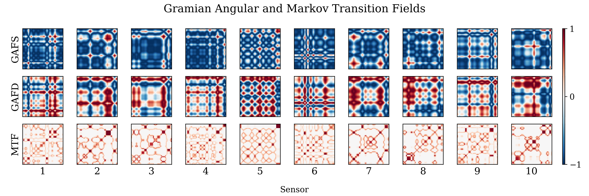
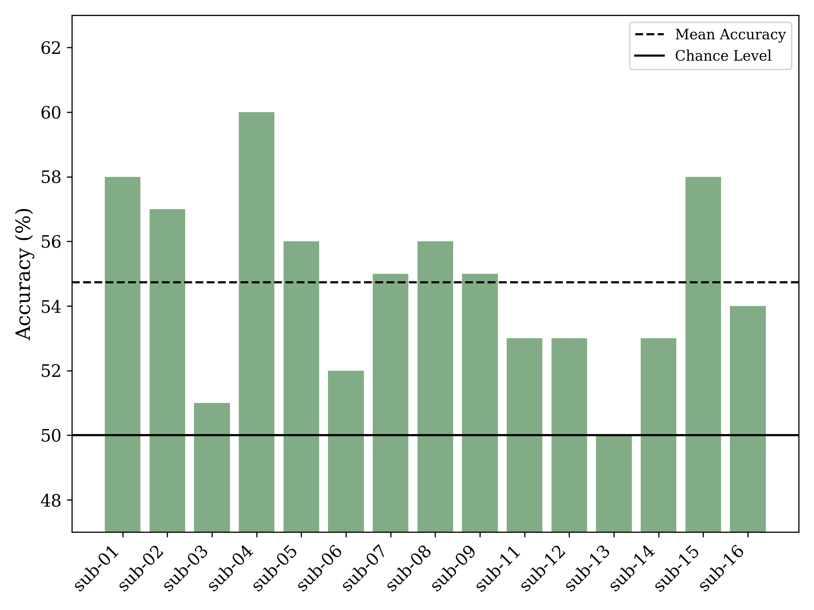
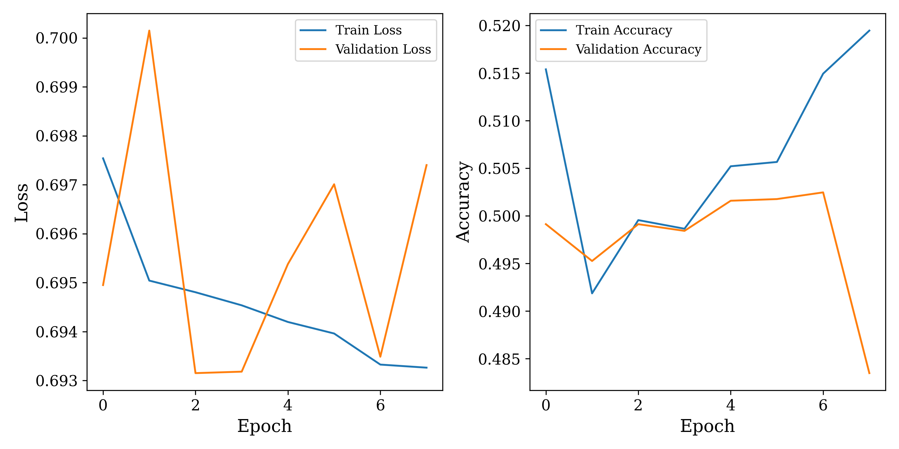

# CNN classification of object category from EEG timeseries data transformed to images
This repository holds the code for the final project for Visual Analytics (S2023). This includes preprocessing of EEG data, converting the timeseries from the sensors to gramian angular & Markow transitional fields, and the training and testing a 3D convolutional neural network on the data.

## Motivation for using CNNs on EEG data
Using machine-learning model on timeseries data such as EEG data can be challenging, as it is often high-dimensional and the temporal structure is not easily captured by the model. One way to overcome this is to transform the timeseries data into images representing temporal correlation between each pair of timeseries, which can be fed to a convolutional neural network (CNN). 

## Description of the data
For this project, open-sourced EEG data from openneuro.org was used. The data consists of EEG data from 16 subjects. Each subject particpated in two experiments, where only the first was used for the current analysis. Participants were presented with a stream of images at 5 Hz. The stimuli consisted of 200 different images, which can be grouped into animate and inanimate stimuli. More information about the data can be found [here](https://openneuro.org/datasets/ds004018/versions/2.0.0).

The data is converted into 50 x 50 x 3 x 63 numpy arrays which are fed to the CNN model. The first two dimensions are the height and width of the images, the third dimension is the number of channels (3 for the GAFS, GAFD and Markow transitional field), and the last dimension is the number of timeseries (number of sensors).

Below is an illustration of the layers of the data fed to the CNN model. The first row shows the GAFS, the second row is the GAFD, and the third row is the Markow transitional field. Only representations of the first 10 timeseries are shown, but for each trial 63 timeseries are included (one for each sensor). The GAFS and GAFD contain values between -1 and 1, while the Markow transitional field contains values between 0 and 1.



## Usage and reproduciblity
1. Download the data following the instructions in the `readme.md` in the `data` directory. 
2. Create a virtual environment and install the dependencies
```
bash setup.sh
```
3. Run preprocessing, GAF and Markow transitional field conversion, and CNN training and testing
```
bash run.sh
```

## Repository structure
```
├── data
│   ├── raw
│   ├── preprocessed
│   └── gaf
├── env
├── fig
├── mdl
│   ├── sub-01
│   ├── sub-02
│   └── ...
├── src
│   ├── cnn_funcs.py
│   ├── cnntorch.py
│   ├── plot_gaf.py
│   ├── plot_results.py
│   ├── preprocess_eeg.py
│   └── timeseries2gaf.py
├── README.md
├── requirements.txt
├── run.sh
└── setup.sh
```


## Results
In the original paper by Grootswagers et al. (2019) using the same data, the animacy was decoded using linear discriminant analysis within subjects. For each timepoint a classifer was trained. The mean accuracy across subjects nearly reached 56% (chance level is 50%) at approximately 400 ms after stimulus onset. 

For the CNN model implemented in this repository, the mean accuracy did not exceed that of the original paper. As seen in the plot below a great variation in the accuracies across subjects is observed. The number of epochs, batch size and other parameters were chosen based on running the model on sub-01. It cannot be ruled out that other parameters would have been more optimal for other subjects.



The validation accuracy curves for each sub-13 are shown below (the subject with the lowest test accuracy). The plot suggest that the model is overfitting, as the validation accuracy plummets after the sixth epoch, while the training accuracy continues to increase. Training for fewer epochs might have improved the results for this subject.


Implementing grid search to find the optimal parameters for each subject could improve the results. However, this would be computationally expensive and time consuming.


## References
*The representational dynamics of visual objects in rapid serial visual processing streams* - Grootswagers, Robinson, Carlson (2019)