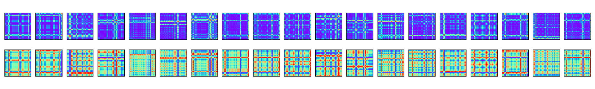

# Classifying alzheimers using gramian angular field and 3D convolutional networks

## Data
The data used for this project was found on openneuro.org. The data contains EEG recordings of patients suffering from alzheimers or frontotemporal dementia, as well as from controls. 

Instructions on how to download the data can be found in the `readme.md` in the `data` directory. 

## Usage
1. Download the data following the instructions in the  `readme.md` in the `data` directory. 
2. Create a virtual environment and install the dependencies
```
bash setup.sh
```
3. Preprocess the EEG data
```
python src/preprocess_eeg.py
```
4. Get the Gramian angular fields for timeseries EEG data
```
python src/timeseries2gaf.py
```
5. Train and test the convolutional neural network
```
python src/cnn.py
```

## Repository structure
