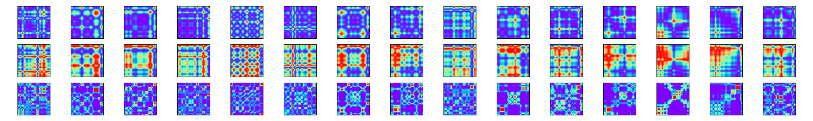

# CNN classification of object category from EEG timeseries data transformed to images
This repository holds the code for the final project for Visual Analytics (S2023). This includes preprocessing of EEG data, converting the timeseries from the sensors to gramian angular fields (both GAFS and GAFD) and Markow transitional fields, and training and testing a 3D convolutional neural network on the data.

Below is an example of the layers of the data fed to the CNN model. The first row shows the GAFS, the second row is the GAFD, and the third row is the Markow transitional field. Only the first 10 timeseries are shown, but for each trial there are 63 timeseries (one for each sensor). The GAFS and GAFD are contain values between 0 and 1, while the Markow transitional field contains values between 0 and 1.



## Data
For this project, open-sourced EEG data from openneuro.org was used. The data consists of EEG data from 16 subjects. Each subject particpated in two experiments, where only the first was used for the current analysis. Participants were presented with a stream of images at 5 Hz. The stimuli consisted of 200 different images, which can be grouped into animate and inanimate stimuli. More information about the data can be found [here](https://openneuro.org/datasets/ds004018/versions/2.0.0).

Instructions on how to download the data can be found in the `readme.md` in the `data` directory. 

## Usage
1. Download the data following the instructions in the `readme.md` in the `data` directory. 
2. Create a virtual environment and install the dependencies
```
bash setup.sh
```
3. Preprocess the EEG data
```
python src/preprocess_eeg.py
```
4. Get the gramian angular fields (both GAFD and GAFS) and Markow transitional fields for timeseries EEG data
```
python src/timeseries2gaf.py
```
5. Train and test the convolutional neural network
```
python src/cnn.py
```

## Repository structure
